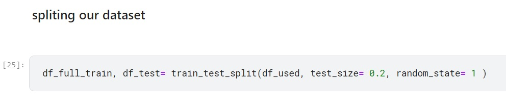

# stroke_prediction
ML-zoomcamp-midterm-project
 ---- 
## Problem description
According to the World Health Organization (WHO), stroke is the second leading cause of death globally, and is responsible for approximately 11% of all deaths.
This data set is used to predict whether a patient is likely to have a stroke based on input parameters from the dataset. The dataset size is 5110 rows, where each row in the data provides relevant information about the patient, and 12 columns, each providing a different feature.

In this project, an ML model predicts the risk likelihood (the possibility of a potential risk occurring, interpreted using qualitative values such as low, medium, or high) of a stroke for a patient based on age, heart disease, hypertension, avg_glucose_level, and smoking status; these five features were found after EDA to be the most features that tell more on the risk of a stroke for patients. With accuracy of 86% that can be further improved by more feature egineering and ML paramter tuning.

(Note: Feature engineering refers to manipulation — addition, deletion, combination, mutation — of your data set to improve machine learning model training, leading to better performance and greater accuracy.)

With an increased synergy between technology and medical diagnosis, caregivers create opportunities for better patient management by systematically mining and archiving the patients’ medical records. Therefore, by deploying this ML model in the deployment process, the hospitals can use this ML service by estimating the likelihood of a stroke for their patients and taking the necessary action.
## Exploratory data analysis (EDA)
### A quick view on the dataset
This is done by first take a view at different random samples from the data. 
Then, take a view at the numerical data by `df.describe()` to see the count ,the five number summary, the mean and the std(standard deviation).
Finally, view information about the dataset by running the `df.info()` which prints information about a Dataset including the number of columns, column labels, column data types, memory usage, range index, and the number of cells in each column (non-null values). 

   Describe             |  Info
:-------------------------:|:-------------------------:
  |  

Findings from this quick view: 
- some categorical features(like, hypertension, heart disease and stroke) datatypes are numerical ones, and not object.
- There is non-null values in all of the columns which is okay but must find what is used to fill missing values(for ex, either filled it with zeros or nan)
### EDA on Categorical features
EDA is done to know what categorical features are important in my stroke prediction. 
First, Change the datatypes of hypertension and heart disease from int64 to object.
(hypertension: 0 if the patient doesn't have hypertension, 1 if the patient has hypertension 
heart_disease: 0 if the patient doesn't have any heart diseases, 1 if the patient has a heart disease)

note: (Leaving stroke feature as int64 ,it's 1 if the patient had a stroke or 0 if not, and this will help us in the upcoming steps.)

Secondly, proceed the EDA of the categorical features

- The missing categorical values is filled with "unkown" and this information is available in the kaggle information section about dataset. 
 
note: when saying calculate the mean, it's the mean of stroke column calculated for different groups and globally for all the dataset. 

- Calculate the mean related to different groups, this mean tells us the stroke risk that some group could have in other words, it  tells us the stroke risk likelihood of indiviuals belong to that group could have. The result of the calcutation is stroke risk for each group.
 
- Calculate the risk ratio of different groups, which is simply dividing the individual mean of each group by the global stroke mean of the dataset(the global stroke mean= 0.048728).The result is risk ratio. 

- Calculate the mutual information for different groups.

The results of these three calculations:
- The mutual information results are okay but not logical as it says that the ever_married and work_type featrues tells us more about stroke than features like hypertension, heart_disease and smoking_status.

- The problem with the risk ratio results is that they're not specific enough, which causes them to have some results that are not logical and affects the selection of the important features because they do not highlight any feature.
For example, in the figure below, the female feature is 0.96 points above average, which indicates high risk for females, and patients with heart disease are 3.494 points above average, which indicates high risk for this group of patients as well.

- The results of stroke risk for each group put things into perspective by being more specific to each group, which makes all the results logical and therefore highlights the importance of some features over others. These highlighted features tell us more about a stroke and can actually increase the likelihood of one occurring.
In the figure below, for example, women have a 4% risk of having a stroke, whereas patients with heart disease have a 17% risk. 

In conclusion, After doing this EDA on categorical features, The selected  important features are  heart_disease, hypertension, and smoking_status.

### EDA on Numerical feature

- The missing numerical values are not mentioned in the Kaggle info section of the data set, so a check is done by the below code. This code checks only for nan because this value can cause errors later while training the model, and also because when we ran df.describe() earlier, the min value for all numerical features was greater than zero.

- Calculating the co-relation to find the association and co-realtion srength of different numerical features with the stroke feature. 

In conclusion, the Body mass index (bmi) has a very low correlation strength, while age has a medium correlation strength, and the average glucose level has a low but acceptable correlation strength, so these two later numerical features are more important and therefore selected.

## Training different models
talk about the training steps

First, before starting training and evaluating the model, the split of the dataset is done by train_test_split, which will split the dataset into 80% for training & validation, and 20% for testing.

Second, cross-validation is performed on the 80% fragment(df_full_train), which trains and validates three different ML models (logistic regression, Random forest, and XGBoost). The evaluation criteria used is ROC_auc_score, which helps us select the best model to use for this project.

Note :
- ROC_auc_score Measures how well the model predicts true positives and true negatives.(ROC stands for Receiver Operating Characteristics and it's a curve , While AUC stands for area under the ROC curve). In other words, AUC score in probability terms is equal to the probability that a classifier will rank a randomly chosen positive instance higher than a randomly chosen negative one.

- Cross_validation used is called k-fold CV, the training set is split into k smaller sets. 
- The following procedure is followed for each of the k “folds”:
- A model is trained using k-1  of the folds as training data; 
- the resulting model is validated on the remaining part of the data (i.e., it is used as a test set to compute a performance measure such as accuracy).

The performance measure reported by k-fold cross-validation is then the mean of the values computed in the loop.(see figures below)

### cross-validate the Random forset model

### cross-validate the XGboost model

  xgb parameters          |  xgb cross-validation
:-------------------------:|:-------------------------:
 |   

### cross-validate logistic regression

The parameters of logistic regression are `LogisticRegression(solver='liblinear', C=1.0, max_iter= 1000)`

In conclusion, from the cross-validation results of the three models, the performance of logistic regression is better than the other two models; Therefore, a logistic regression model is selected.

## Flask Model deployment 
- The ML service returns a response that include the prediciton_probaility and the risk_liklihood based on that prediction.

  test the deployment         |  result
:-------------------------:|:-------------------------:
 |   

## Dependency and enviroment management

- install pipenv with `pip install pipenv`

- To run the project on another machine, we can easily install the libraries we want with the command `pipenv install`. This command will look into Pipfile and Pipfile.lock to install the libraries with the specified version.

- After installing the required libraries we can run the project in the virtual environment with `pipenv shell` command. This will go to the virtual environment's shell and then any command we execute will use the virtual environment's libraries.

- to run the waitress wgsi server use the command `waitress-serve --listen=0.0.0.0:9696 predict risk of stroke:app`

## Containerization

Clone the repo using this command.

git clone (https://github.com/NashatAlli/stroke_prediction.git) 
Then you need to be shure that you have docker installed. You can check it using this command.
docker --version
If it outputs current version everything is ok, continue. If yout don't have docker you need firstly install it.

Now build the docker image using Dockerfile from reposity. You need to be in the project folder and perfrom this command in a terminal.

`docker build -t [add image name:image tag] .` (the dot at the end refers to the path to the current directory, since Dockerfile is in that directory)

Then to run a container based on that image, the below command will be used. It will perfrom all needed instruction from Dockerfile and run the flask server locally via 9696 port to have acces to model testing. All dependencies are defined in Pipfile which docker uses automatically.

`docker run -it --rm -p (add port on the host machine to bind to the container's port : the container port that the host will be bound to) [image name:image tag]`

The port numbers used in this project are 7777 for the exposed port (the container port to which the host will be bound) and 9898 for the non-specific host machine port.(non-specific means any chosen host machine port number) 

